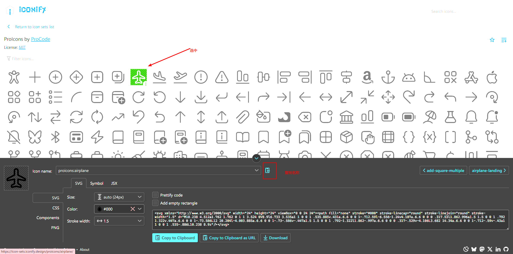

## ✍基于Nuxt3+TypeScript开发的个人博客


### start
```
yarn install

npm run dev 

```

### 目录说明

```.
├── components
│   ├── Header.vue
│   ├── Footer.vue
│   └── Home
|   |   |
|   |   |———Card.vue
├── content
│   ├── index.md
│   ├── about.md
│   ├── notes
│   │   ├── vue.md
│   │   ├── nuxt.md
│   │   └── ...
│   └── 
└── layouts
|   |___default.vue
|   |——...
|   |
└── middleware
|    |___router.global.ts
|    |___...
|    |
|____pages
     |
     |___index.vue
     |___Post
     |    |
     |____|___[...post.vue]


```
- [components](https://nuxt.com.cn/docs/guide/directory-structure/components)

  全局组件,在页面中使用无需注册

  ``` js
  // 使用components下的Footer
  <Footer />

  // 使用components下Home文件夹下的Card.vue
  <HomeCrad /> // Home + Card 
  ```

- content

  存放静态文档的目录，也是[nuxt content](https://nuxt.com.cn/docs/guide/directory-structure/content#%E5%90%AF%E7%94%A8nuxt-content)默认查找的目录；
  ```
  查找content下的一级目录 ： <ContentDoc path="about"/>
  查找content下的二级目录：  <ContentDoc path="/notes/nuxt" />
  ```

- [layout](https://nuxt.com.cn/docs/guide/directory-structure/layouts)

    应用布局组件目录
  
- [middleware](https://nuxt.com.cn/docs/guide/directory-structure/middleware)

    路由中间件

- [pages](https://nuxt.com.cn/docs/guide/directory-structure/pages)

    每一个文件，都代表一个路由地址，如index.vue --> /    post/a.vue --> post/a

### 其他
  1. 评论功能

     github Giscus  https://giscus.app/zh-CN

  2. 图标

     使用 [nuxt/icon](https://nuxt.com.cn/modules/icon)模块
    
      ```
      <Icon name="proicons:search">
      // name字段指定要渲染哪个集合下的图标，可以在这里面选择想要的图标 https://icon-sets.iconify.design/
      ```

      